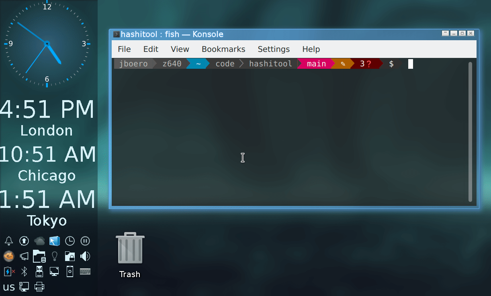

# HashiTool
Open source PyWX systray tool to use and manage HashiCorp products.

This is currently just a skeleton.  It still needs meat and skin in the form
of settings storage and client API interactions.

# Dependencies
python3-wx

# Usage
